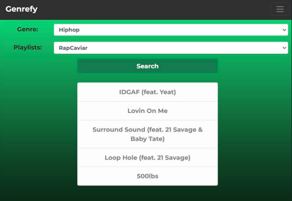
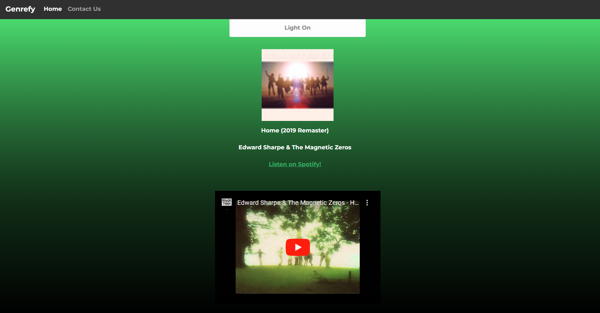
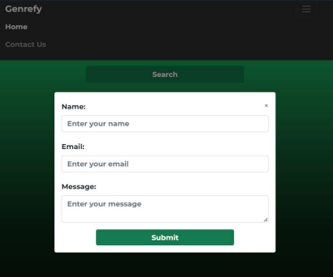

# **Genrefy**

Web App implemented using Spotify API and YouTube v3 Data API

## **Spotify API**

- Genres and official playlists of chosen genre
- Top 5 tracks from chosen playlist are shown from which user can select one
- Track information including song name, artist and album art are displayed after selection

## **YouTube Data v3 API**

- After track selection, an embedded mini-player of the track's YouTube video is displayed
- **NOTE:** The video shows up as unavailable if the owner disabled embed settings during the upload process

## **Formspree API**

- Contact Us submissions are handled by the Formspree API so that you can send us a message!

## **Screenshots**

](res/image.png)

](res/image-3.png)

](res/image-4.png)

## **How to use**

- Plug in your Spotify Client ID and Client Secret here:

```js
const clientId = YOUR_SPOTIFY_CLIENT_ID;
const clientSecret = YOUR_SPOTIFY_CLIENT_SECRET;
```

- Plug in your YouTube API Key here:

```js
const youtubeApiKey = YOUR_YOUTUBE_API_KEY;
```

- Lastly, You'll need a Formspree API Key to send us developers a message:

```html
<form action="YOUR_FORMSPREE_API_KEY" method="POST"></form>
```

- After you've put in your API keys, launch up a live server from VSCode and discover new music!

### **Made by Nick, Jerry, Conlan and Abhijay**
